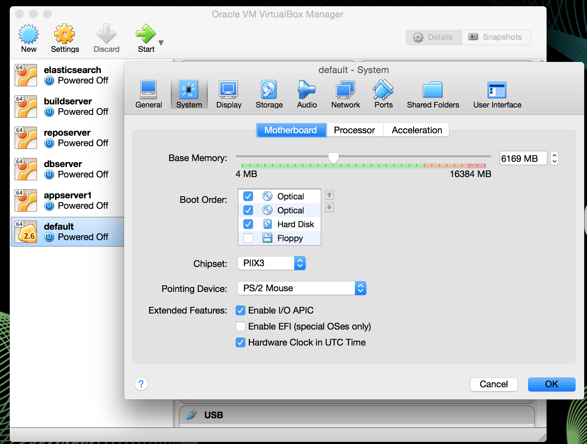
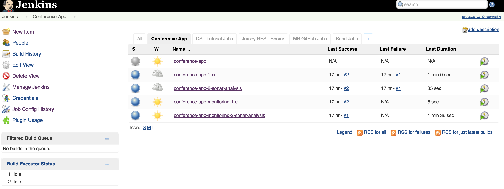

# CI Tools Demo

This GitHub repository contains Dockerfiles for running a set of Continuous Integration Tools with a single command. The diagram contains all tools used in the Docker containers.


Blog article on the CI Docker Container, https://blog.codecentric.de/en/2015/10/continuous-integration-platform-using-docker-container-jenkins-sonarqube-nexus-gitlab

## Prerequisites (Mac)

You should have Docker Toolbox installed, see https://www.docker.com/toolbox

I am using docker-compose to start several docker container at once.
Since all containers run in a single VM (virtualbox), this VM needs enough memory.

### Step 0 - List Docker Machine

```
~/git/docker-ci-tool-stack$ docker-machine ls

NAME      ACTIVE   DRIVER       STATE     URL                         SWARM
default   *        virtualbox   Running   tcp://192.168.99.100:2376
```

### Step 1 - Stop your docker VM

```
docker-machine stop default
```

### Step 2 - Increase Memory via VirtualBox UI

I am using 6000MB for my VM.



### Step 3 - Start VM

```
docker-machine start default
```

## Getting started

To get all docker containers up and running use:

```
git clone git@github.com:marcelbirkner/docker-ci-tool-stack.git
cd docker-ci-tool-stack
docker-compose up
```

## Access Tools

| *Tool* | *Link* | *Credentials* |
| ------------- | ------------- | ------------- |
| Jenkins | http://${docker-machine ip default}:8080/jenkins/ | no login required |
| SonarQube | http://${docker-machine ip default}:9000/ | admin/admin |
| Nexus | http://${docker-machine ip default}:8081/nexus | admin/admin123 |
| GitLab | http://${docker-machine ip default}:10080/ | root/5iveL!fe |
| Selenium Grid | http://${docker-machine ip default}:4444/grid/console | no login required |

## Screenshots

Here is an overview of all tools:

- GitLab is used for storing the Source Code
- Jenkins contains build job and is triggered once projects in GitLab are updated
- As part of the CI build, Jenkins triggers a static code analysis and the results are stored in SonarQube
- The Maven build uses Nexus as a Proxy Repository for all 3rd party libs. The build artifacts are deployed to the Nexus Release Repository
- The Selenium Grid contains Docker containers running Chrome and Firefox and is used for UI tests

### Jenkins Jobs

There are several jobs preconfigured in Jenkins.
The Jobs cover the following tasks:

- Continuous Integration Build with Maven
- Unit Tests
- Static Source Analysis results are stored in SonarQube
- JaCoCo Test Coverage
- Deployment to Nexus
- Jenkins Job DSL examples
- Selenium UI Test




### SonarQube Dashboard


### Nexus Repository


### Selenium Grid


